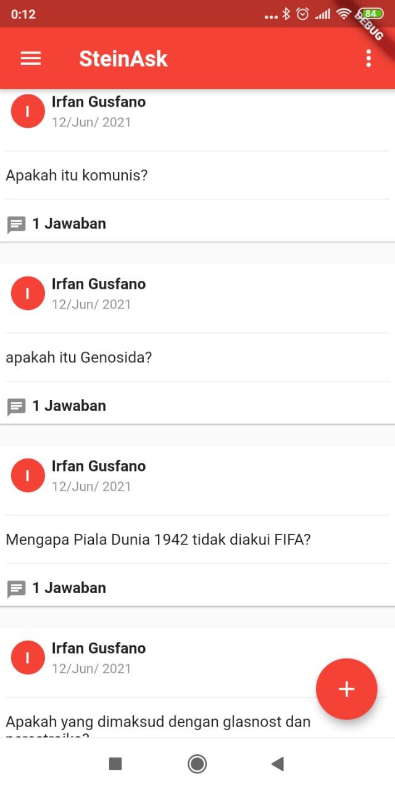
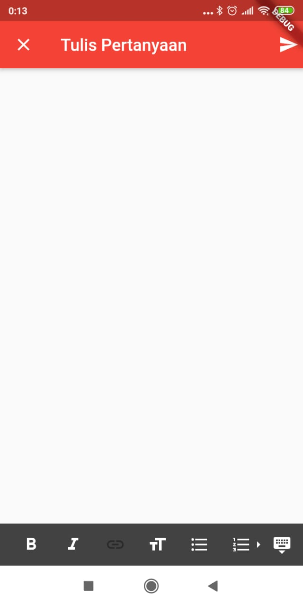
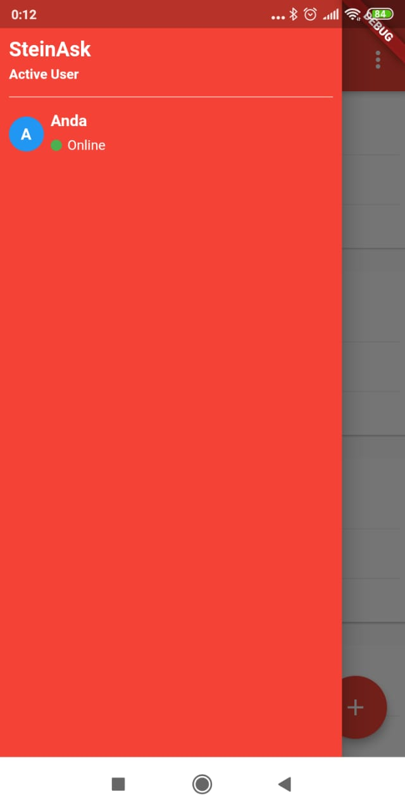

# Aplikasi Forum

Aplikasi ini menggunakan state management GetX dan Socket.IO untuk realtime data
menggunakan GetxController dan GetBuilder untuk update UI,menggunakan Getx Navigation untuk
navigasi halaman,GetXService untuk handling notification dari Socket.IO

untuk user bisa di register atau bisa lihat di database passwordnya semua giorno95

Silahkan ubah alamat API di file lib\helper\server.dart

untuk dokumentasi API dan Dashboard silahkan
download di <a id="raw-url" href="https://github.com/mrstein21/forum_api">https://github.com/mrstein21/forum_api</a>

Selamat Mempelajari,Semoga Bermanfaat

 Screen Shoot Aplikasi :
 
   
 
   
 
    
  

